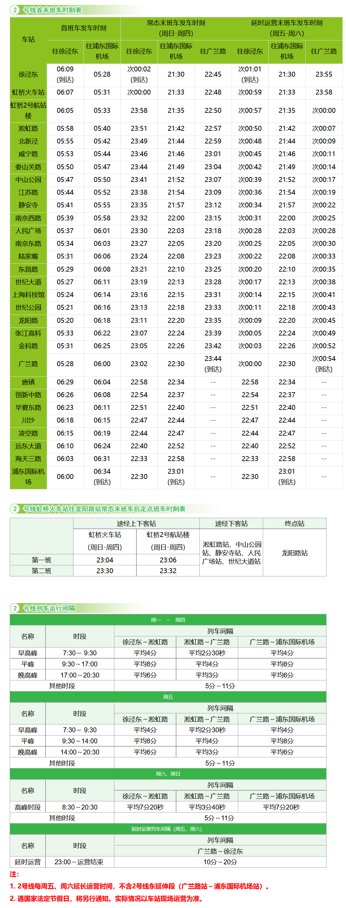

# 上海地铁2号线

上海地铁2号线，是上海第二条开通运营的轨道交通线路，于2000年6月11日开通试运营。线路西起青浦区徐泾东站，途径青浦区、闵行区、长宁区、静安区、黄浦区、浦东新区，东至浦东新区浦东国际机场站。

线路全长64km，共30站，其中高架站2座，地面站1座，地下站27座。

线路标识色为#97D700，采用8A编组列车，最大时速80km/h，由上海地铁第二运营有限公司运营。

## 历史
* 1995年12月，上海地铁2号线开工建设。
* 1999年9月，上海地铁2号线（中山公园站至张江高科站）开始试运行。
* 2000年6月11日，上海地铁2号线（中山公园站至龙阳路站）开通试运营，线路全长16.3千米；同年12月27日，上海地铁2号线首段东延伸段（龙阳路站至张江高科站）开通运营，线路总长增加至19.1千米。
* 2005年10月22日，原东方路站（现世纪大道站）封闭以配合上海地铁6号线和上海地铁9号线的建设。
* 2006年7月18日，原东方路站更名为世纪大道站；同年12月30日，上海地铁2号线西延伸段（中山公园站至淞虹路站）共四站开通运营，线路总长增加至25.2千米；同日，上海地铁2号线东延伸段（龙阳路站至浦东国际机场站）正式开工建设。
2010年2月14日，为配合东延伸段建成试运营以及新老张江高科站的线路割接，张江高科站至龙阳路站暂停运营10天；同月24日，上海地铁2号线东延伸段一期（张江高科站至广兰路站）建成试运营，新张江高科站及龙阳路经新张江高科站至广兰路段启用，原张江高科高架车站及区间停用；同年3月16日，上海地铁2号线西延伸段（徐泾东站至淞虹路站）开通运营，其中虹桥火车站站为过站不停靠；同年4月8日，上海地铁2号线东延伸段二期（广兰路站至浦东国际机场站）开通运营，采用非高峰运营模式；同年7月1日，上海地铁2号线西延伸段虹桥火车站站开通运营；同年7月10日，上海地铁2号线东延伸覆盖早晚高峰（需要在广兰路站下车换乘对面站台的列车）。
2018年12月28日，上海地铁2号线8节编组列车全线载客试运营，首班车0257号车（青鲶鱼）直通上海浦东国际机场；次日起，上海地铁2号线部分列车直达浦东国际机场。
2019年4月19日，上海地铁2号线全运营时段开行8节编组列车直通浦东国际机场。 同年10月23日，上海地铁2号线启用新列车运行图，且东延伸段原有部分4节编组列车全部下线，该区段全运营时段运行8节编组列车。

## 运营时间

## 所用车型
### 02A01
* 曾用型号：AC-02A
* 制造商：德国ADTranz、西门子公司
* 设计时速：80km/h
* 车辆编组：8A(Tc+Mp+M+Mp+M+Mp+M+Tc)
* 车厢：长23.54米，宽3米
* 设计寿命：30年
* 车辆总数：16列(02001-02016)
* 昵称：西瓜
### 02A02
* 曾用型号：AC-08
* 制造商：阿尔斯通南京浦镇车辆厂、上海电气
* 设计时速：80km/h
* 车辆编组：8A(Tc+Mp+Mp+M+Mp+M+Mp+Tc)
* 车厢：长23.54米，宽3米
* 设计寿命：30年
* 车辆总数：21列(02033-02053)
* 昵称：青鱼
### 02A03
* 曾用型号：AC-17A
* 制造商：阿尔斯通南京浦镇车辆厂、上海电气
* 设计时速：80km/h
* 车辆编组：8A(Tc+Mp+Mp+M+Mp+M+Mp+Tc)
* 车厢：长23.54米，宽3米
* 设计寿命：30年
* 车辆总数：16列(02054-02069)
* 昵称：鲶鱼
### 02A04
* 曾用型号：AC-17B
* 制造商：阿尔斯通南京浦镇车辆厂、上海电气
* 设计时速：80km/h
* 车辆编组：8A(Tc+Mp+Mp+M+Mp+M+Mp+Tc)
* 车厢：长23.54米，宽3米
* 设计寿命：30年
* 车辆总数：16列(02070-02085)
* 昵称：扩编鲶鱼
### 02A05
* 制造商：中车株洲电力机车有限公司
* 设计时速：80km/h
* 车辆编组：8A(Tc+Mp+M+Mp+M+M+Mp+Tc)
* 车厢：长23.54米，宽3米
* 设计寿命：30年
* 车辆总数：31列(02086-02116)
* 昵称：扩编鲶鱼

## 车辆基地
* 龙阳路车辆段
* 川沙停车场
* 北翟路车辆段