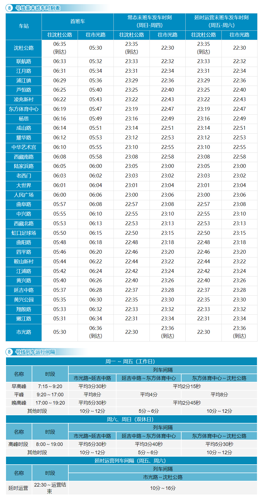

# 上海地铁8号线

上海地铁8号线，是上海第六条开通运营的轨道交通线路（与[6号线](./6.md)、[9号线](./9.md)同日开通），于2007年12月29日开通试运营。线路北起杨浦区市光路站，途径杨浦区、虹口区、静安区、黄浦区、浦东新区、闵行区，南至闵行区沈杜公路站。

线路全长37.5km，共30站，其中高架站4座，地下站26座。

线路标识色为#00A3E0，采用6C/7C编组列车，最大时速80km/h，由上海地铁第四运营有限公司运营。

## 历史
* 2007年12月29日，上海地铁8号线一期工程（市光路站至耀华路站）开通运营。
* 2009年1月24日，上海地铁8号线启用人民广场站新站台。7月5日，上海地铁8号线二期工程（耀华路站至沈杜公路站）开通运营。
* 2011年4月12日，上海地铁8号线二期工程站点济阳路站（现东方体育中心站）开通运营。5月7日，为配合第14届国际泳联世界锦标赛的进行，济阳路站更名为东方体育中心站。
* 2012年9月28日，上海地铁8号线一期工程遗留站点周家渡站（开通同时更名为中华艺术宫站）开通运营。
* 2013年8月31日，上海地铁8号线二期工程终点站航天博物馆站改名为沈杜公路站。

## 运营时间

## 所用车型
### 08C01
* 曾用型号：AC-07
* 制造商：法国阿尔斯通公司、上海阿尔斯通交通设备有限公司
* 设计时速：80km/h
* 车辆编组：6C(Tc+Mp+M+M+Mp+Tc)
* 车厢：Tc长19.49米，Mp长19.44米，宽2.6米
* 设计寿命：30年
* 车辆总数：28列(08001-08028)
* 昵称：蓝精灵
### 08C02
* 曾用型号：AC-15A
* 制造商：中国北车、长春轨道客车股份有限公司、上海阿尔斯通交通设备有限公司
* 设计时速：80km/h
* 车辆编组：7C(Tc+Mp+M+M+M+Mp+Tc)
* 车厢：Tc长19.49米，Mp长19.44米，宽2.6米
* 设计寿命：30年
* 车辆总数：18列(08029-08046)
* 昵称：泥鳅
### 08C03
* 曾用型号：AC-15B
* 制造商：中国北车、长春轨道客车股份有限公司、上海阿尔斯通交通设备有限公司
* 设计时速：80km/h
* 车辆编组：7C(Tc+Mp+M+M+M+Mp+Tc)
* 车厢：Tc长19.49米，Mp长19.44米，宽2.6米
* 设计寿命：30年
* 车辆总数：20列(08047-08066)
* 昵称：泥鳅二世
### 08C04
* 制造商：中国北车、长春轨道客车股份有限公司、上海阿尔斯通设备有限公司
* 设计时速：80km/h
* 车辆编组：7C(Tc+Mp+M+M+M+Mp+Tc)
* 车厢：Tc长19.49米，Mp长19.44米，宽2.6米
* 设计寿命：30年
* 车辆总数：26列(08067-08090)
* 昵称：泥鳅三世

## 车辆基地
* 殷行车辆段
* 浦江镇停车场