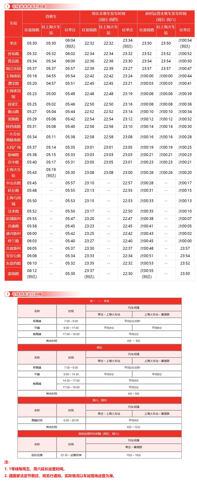

# 上海地铁1号线

上海地铁1号线，是上海第一条开通运营的轨道交通线路，于1993年5月28日开通试运营。线路北起宝山区富锦路站，途径宝山区、静安区、黄浦区、徐汇区、闵行区，南至闵行区莘庄站。

线路全长36.89km，共28站，其中高架站9座，地面站4座，地下站15座。

线路标识色为红色，采用8A编组列车，最大时速80km/h，由上海地铁第一运营有限公司运营。

## 历史
* 1990年1月19日，中华人民共和国国务院批准上海地铁1号线一期工程动工。按“分段建设、分段通车”原则，一期工程划分为南、中、北3段。
* 1993年1月10日，上海地铁1号线首列地铁列车进入新龙华站（今上海南站站附近）至徐家汇站区间上行正线试车调试。4月9日，上海地铁1号线南段（徐家汇站至锦江乐园站）开通，对外售票观光试运营，这是上海第一条轨道交通线路。5月28日，上海地铁1号线南段（锦江乐园站至徐家汇站）双线开通观光试运营。
* 1994年12月10日，上海地铁1号线南延伸段一期（莘庄站至锦江乐园站）开工建设。12月12日，上海地铁1号线一期工程全线开通调试。
* 1995年4月10日，上海地铁1号线一期工程北段（衡山路站至上海火车站站）开通试运营。5月19日，时任国家主席江泽民视察上海地铁1号线。7月，上海地铁1号线一期工程全线正式投入运营，线路总长达到16.1千米。
* 1996年12月28日，上海地铁1号线南延伸段一期（莘庄站至锦江乐园站）建成通车运营，全长5.25千米，为全封闭地面线，锦江乐园站更名为虹梅路站（后于2001年5月1日改回锦江乐园站）。
* 1997年1月1日起，上海地铁1号线南延伸段实现锦江乐园站↔莘庄站和上海火车站站↔锦江乐园站的分段通车运营。7月1日，上海地铁1号线莘庄站至上海火车站站实现全线联通运营。实行2元、3元两级分段票价：乘坐13站及以下的票价为2元，乘坐13站以上的票价为3元（后于2005年9月15日调整）。
* 2004年12月28日，上海地铁1号线北延伸段（上海火车站站至共富新村站）开通运营。
* 2007年7月4日，上海地铁1号线首列6节编组改8节编组列车上线调试运营。
* 2007年12月29日，上海地铁1号线北北延伸段（共富新村站至富锦路站）开通运营。

## 运营时间

## 所用车型
### 01A01
* 曾用型号：DC-01A(01002)、DC-01B(01001,01003-01010,01014)
* 制造商：德国ADTranz原产，南车株洲改造
* 设计时速：80km/h
* 车辆编组：8A(A+B+C+B+C+B+C+A)
* 车厢：长23.54米，宽3米
* 设计寿命：30年
* 车辆总数：11列(01001-01010,01014)
* 昵称：老老八
### 01A02
* 曾用型号：DC-01C
* 制造商：德国ADTranz原产，南车株洲改造
* 设计时速：80km/h
* 车辆编组：8A(A+B+C+B+C+B+C+A)
* 车厢：长23.54米，宽3米
* 设计寿命：30年
* 车辆总数：5列(01011-01013,01015-01016)
* 昵称：伪八二世
### 01A03
* 曾用型号：AC-01A(01018-01025)、AC-01X(01017)
* 制造商：德国ADTranz原产，南车株洲改造
* 设计时速：80km/h
* 车辆编组：8A(A+B+C+B+C+B+C+A)
* 车厢：长23.54米，宽3米
* 设计寿命：30年
* 车辆总数：9列(01017-01025)
* 昵称：老八
### 01A04
* 曾用型号：AC-01B(01026-01029)、AC-01C(01030-01037)
* 制造商：德国ADTranz原产，南车株洲改造
* 设计时速：80km/h
* 车辆编组：8A(A+B+C+B+C+B+C+A)
* 车厢：长23.54米，宽3米
* 设计寿命：30年
* 车辆总数：12列(01026-01037)
* 昵称：伪八
### 01A05
* 曾用型号：AC-06
* 制造商：阿尔斯通南京浦镇车辆厂、上海电气
* 设计时速：80km/h
* 车辆编组：8A(Tc+Mp+M+Mp+M+M+Mp+Tc)
* 车厢：长23.54米，宽3米
* 设计寿命：30年
* 车辆总数：16列(01040-01055)
* 昵称：胖头鱼
### 01A06
* 制造商：中车株洲电力机车有限公司
* 设计时速：80km/h
* 车辆编组：8A(Tc+Mp+M+Mp+M+M+Mp+Tc)
* 车厢：长23.54米，宽3米
* 设计寿命：30年
* 车辆总数：11列(01056-01066)
* 昵称：钢铁侠
### 01A07
* 制造商：中车株洲电力机车有限公司
* 设计时速：80km/h
* 车辆编组：8A(Tc+Mp+M+Mp+M+M+Mp+Tc)
* 车厢：长23.54米，宽3米
* 设计寿命：30年
* 车辆总数：20列(01067-01086)
* 昵称：钢铁侠

## 车辆基地
* 梅陇车辆段
* 富锦路停车场