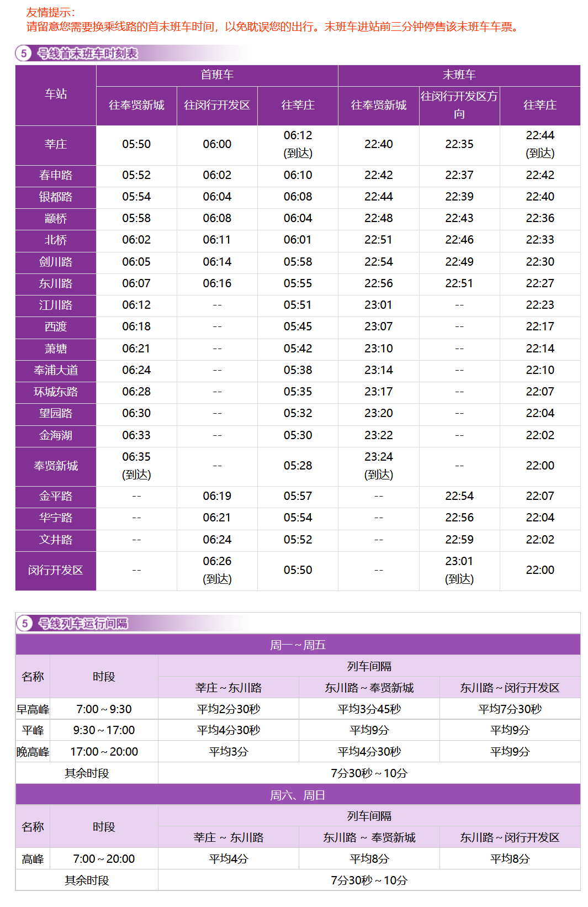

# 上海地铁5号线

上海地铁5号线，是上海第四条开通运营的轨道交通线路，于2003年11月25日开通试运营。线路北起闵行区莘庄站，途径闵行区、奉贤区，南至奉贤区奉贤新城站，支线西至闵行区闵行开发区站。

线路全长32.7km，共19站，其中高架站14座，地面站1座，地下站4座。

线路标识色为#AC4FC6，采用4C/6C编组列车，最大时速80km/h，由上海地铁第一运营有限公司运营。

## 历史
* 2000年8月8日，上海地铁5号线开工建设
* 2003年11月25日，上海地铁5号线（莘庄站至闵行开发区站）开通运营。
* 2014年6月30日，上海地铁5号线南延伸工程开工建设。
* 2018年12月30日，上海地铁5号线南延伸段（东川路站至奉贤新城站）开通运营

## 运营时间

## 所用车型
### 05C01
* 曾用型号：AC-11
* 制造商：法国阿尔斯通公司、上海阿尔斯通交通设备有限公司
* 设计时速：80km/h
* 车辆编组：4C(Tc+Mp+Mp+Tc)
* 车厢：Tc长19.49米，Mp长19.44米，宽2.6米
* 设计寿命：30年
* 车辆总数：17列(05001-05013,05015-05018)
* 昵称：番茄炒蛋
### 05C02
* 制造商：上海阿尔斯通交通设备有限公司、中国北车长春轨道客车股份有限公司
* 设计时速：80km/h
* 车辆编组：6C(Tc+Mp+M+M+Mp+Tc)
* 车厢：Tc长19.49米，Mp/M长19.44米，宽2.6米
* 设计寿命：30年
* 车辆总数：33列(05019-05051)
* 昵称：紫罗兰

## 车辆基地
* 平庄公路定修段
* 蒲汇塘停车场
* 莘庄辅助停车场