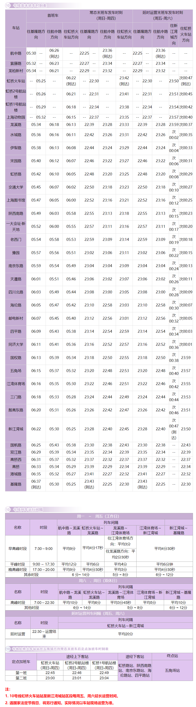

# 上海地铁10号线

上海地铁10号线，是上海第十一条开通运营的轨道交通线路，于2010年4月10日开通试运营。线路北起浦东新区基隆路站，途径浦东新区、杨浦区、虹口区、静安区、黄浦区、徐汇区、长宁区、闵行区，西至闵行区虹桥火车站站，支线北起浦东新区基隆路站，途径浦东新区、杨浦区、虹口区、静安区、黄浦区、徐汇区、长宁区、闵行区、长宁区，西至长宁区航中路站。

线路全长46km，共37站，其中高架站5座，地下站32座。

线路标识色为#C1A7E2，采用6A编组列车，最大时速80km/h，由上海地铁第一运营有限公司运营。

## 历史
* 2010年4月10日，上海地铁10号线主线龙溪路站以东及支线部分（新江湾城站至航中路站）开通运营。同年11月30日，上海地铁10号线主线剩余段（龙溪路站至虹桥火车站站）开通运营。
* 2020年12月26日，上海地铁10号线二期工程（新江湾城站至基隆路站）开通试运营。

## 运营时间

## 所用车型
### 10A01
* 曾用型号：AC-13
* 制造商：上海阿尔斯通交通设备有限公司、南京浦镇车辆厂
* 设计时速：80km/h
* 车辆编组：6A(Tc+Mp+M+M+Mp+Tc)
* 车厢：长23.54米，宽3米
* 设计寿命：30年
* 车辆总数：41列(10001-10041)
* 昵称：热带鱼
* 注：本车曾在1号线运营，编号0130-0139
### 10A02
* 制造商：上海阿尔斯通交通设备有限公司、南京浦镇车辆厂
* 设计时速：80km/h
* 车辆编组：6A(Tc+Mp+M+M+Mp+Tc)
* 车厢：长23.54米，宽3米
* 设计寿命：30年
* 车辆总数：26列(10042-10067)
* 昵称：热带鱼二世

## 车辆基地
* 吴中路停车场
* 港城路车辆段