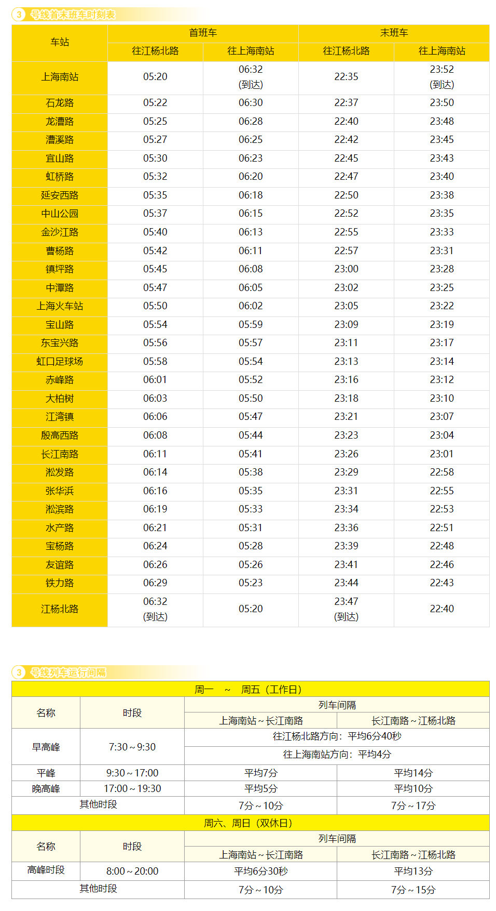

# 上海地铁3号线

上海地铁3号线，是上海第三条开通运营的轨道交通线路，于2000年12月26日开通试运营。线路北起宝山区江杨北路站，途径宝山区、虹口区、静安区、普陀区、长宁区、徐汇区，南至徐汇区上海南站站。

线路全长40.3km，共29站，其中高架站24座，地面站4座，地下站1座，9座车站与[4号线](./4.md)共线。

线路标识色为#FFD100，采用6A编组列车，最大时速80km/h，由上海地铁第三运营有限公司运营。

## 历史
* 1997年6月，上海地铁3号线开工建设，利用老沪杭铁路内环线和淞沪铁路高架进行改造，该项建设工程被列入上海市重大工程。
* 2000年12月26日，上海地铁3号线一期工程试通车，设19座车站线路，线路总长达24.97千米。通车仪式在石龙路站举行。
* 2005年12月31日，上海地铁4号线“C”型段中的虹桥路站至宝山路站的9座车站，与已运营的上海地铁3号线“共线运营”。
* 2006年12月18日，上海地铁3号线北延伸段（江湾镇站至江杨北路站）通车试运营，车站总数达29座，线路总长达40.3千米。

## 运营时间

## 所用车型
### 03A01
* 曾用型号：AC-03
* 制造商：阿尔斯通南京浦镇车辆厂
* 设计时速：80km/h
* 车辆编组：6A(Tc+Mp+M+M+Mp+Tc)
* 车厢：长23.54米，宽3米
* 设计寿命：30年
* 车辆总数：28列(03001-03028)
* 昵称：黄鱼
### 03A02
* 制造商：上海阿尔斯通交通设备有限公司、中国北车长春轨道客车股份有限公司
* 设计时速：80km/h
* 车辆编组：6A(Tc+Mp+M+M+Mp+Tc)
* 车厢：长23.54米，宽3米
* 设计寿命：30年
* 车辆总数：8列(03029-03036)
* 昵称：包公
### 04A02
* 制造商：上海阿尔斯通交通设备有限公司、中国北车长春轨道客车股份有限公司
* 设计时速：80km/h
* 车辆编组：6A(Tc+Mp+M+M+Mp+Tc)
* 车厢：长23.54米，宽3米
* 设计寿命：30年
* 车辆总数：13列(03037-03049)
* 昵称：叛徒包公

## 车辆基地
* 石龙路停车场
* 江杨北路车辆段