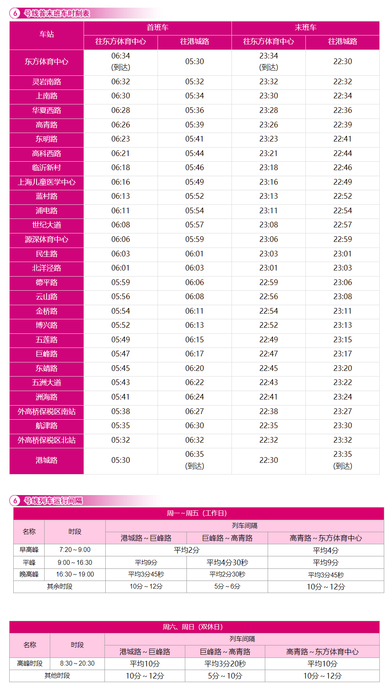

# 上海地铁6号线

上海地铁6号线，是上海第六条开通运营的轨道交通线路（与[8号线](./8.md)、[9号线](./9.md)同日开通），于2007年12月29日开通试运营。线路北起浦东新区港城路站，途径浦东新区，南至浦东新区东方体育中心站。

线路全长33.52km，共28站，其中高架站9座，地下站19座。

线路标识色为#D9027D，采用4C编组列车，最大时速80km/h，由上海地铁第四运营有限公司运营。

## 历史
* 2002年12月，上海地铁6号线开工。
* 2007年12月29日，上海地铁6号线（港城路站至灵岩南路站）通车试运营。
* 2011年4月12日，上海地铁6号线遗留车站济阳路站开通运营。5月7日，为配合第14届国际泳联世界锦标赛的进行，济阳路站更名为东方体育中心站。

## 运营时间

## 所用车型
### 06C01
* 曾用型号：AC-12
* 制造商：法国阿尔斯通公司、上海阿尔斯通交通设备有限公司
* 设计时速：80km/h
* 车辆编组：4C(Tc+Mp+Mp+Tc)
* 车厢：Tc长19.49米，Mp长19.44米，宽2.6米
* 设计寿命：30年
* 车辆总数：21列(06001-06003,06005-06013,06015-06023)
* 昵称：Kitty
### 06C02
* 曾用型号：AC-14A
* 制造商：中国北车、长春轨道客车股份有限公司
* 设计时速：80km/h
* 车辆编组：4C(Tc+Mp+Mp+Tc)
* 车厢：Tc长19.49米，Mp长19.44米，宽2.6米
* 设计寿命：30年
* 车辆总数：11列(06025-06033,06035-06036)
* 昵称：花木兰
### 06C03
* 曾用型号：AC-14B
* 制造商：中国北车、长春轨道客车股份有限公司
* 设计时速：80km/h
* 车辆编组：4C(Tc+Mp+Mp+Tc)
* 车厢：Tc长19.49米，Mp长19.44米，宽2.6米
* 设计寿命：30年
* 车辆总数：18列(06037-06043,06045-06053,06055-06056)
* 昵称：花木兰二世
### 06C04
* 制造商：中国北车、长春轨道客车股份有限公司、上海阿尔斯通设备有限公司
* 设计时速：80km/h
* 车辆编组：4C(Tc+Mp+Mp+Tc)
* 车厢：Tc长19.49米，Mp长19.44米，宽2.6米
* 设计寿命：30年
* 车辆总数：26列(06057-06082)
* 昵称：花木兰三世

## 车辆基地
* 港城路车辆段
* 三林停车场