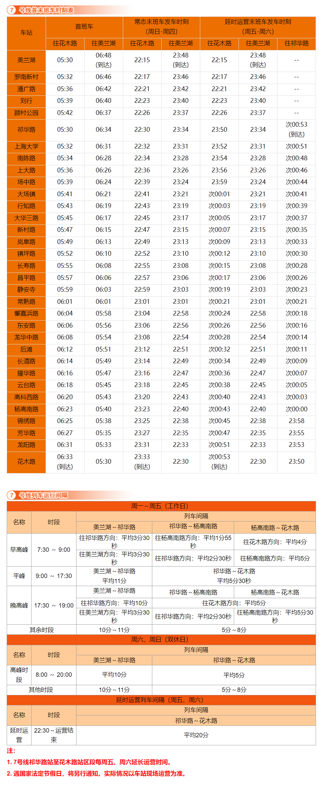

# 上海地铁7号线

上海地铁7号线，是上海第九条开通运营的轨道交通线路，于2009年12月5日开通试运营。线路北起宝山区美兰湖站，途径宝山区、普陀区、静安区、徐汇区、浦东新区，南至浦东新区花木路站。

线路全长44.35km，共33站，其中高架站2座，地下站31座。

线路标识色为#FF6900，采用6A编组列车，最大时速80km/h，由上海地铁第三运营有限公司运营。

## 历史
* 2005年11月24日，上海地铁7号线正式开工建设。
* 2009年12月5日，上海地铁7号线一期工程（上海大学站至花木路站）开通运营。
* 2010年4月20日，后滩站开通运营。12月28日，上海地铁7号线北延伸段（美兰湖站至上海大学站）开通运营。
* 2011年6月30日，潘广路站、刘行站开通运营。
* 2012年12月30日，船厂路站改名为龙华中路站。
* 2014年7月22日，祁华路站开通运营，上海地铁7号线小交路终点站从上海大学站变更为祁华路站。

## 运营时间

## 所用车型
### 07A01
* 曾用型号：AC-10
* 制造商：庞巴迪长春客车
* 设计时速：80km/h
* 车辆编组：6A(Tc+Mp+M+M+Mp+Tc)
* 车厢：长23.54米，宽3米
* 设计寿命：30年
* 车辆总数：42列(07001-07042)
* 昵称：芬达
### 07A02
* 制造商：庞巴迪长春客车
* 设计时速：80km/h
* 车辆编组：6A(Tc+Mp+M+M+Mp+Tc)
* 车厢：长23.54米，宽3米
* 设计寿命：30年
* 车辆总数：30列(07043-07072)
* 昵称：邦迪
### 07A03
* 制造商：庞巴迪长春客车
* 设计时速：80km/h
* 车辆编组：6A(Tc+Mp+M+M+Mp+Tc)
* 车厢：长23.54米，宽3米
* 设计寿命：30年
* 车辆总数：7列(07073-07079)
* 昵称：邦迪

## 车辆基地
* 龙阳路辅助停车场
* 陈太路停车场