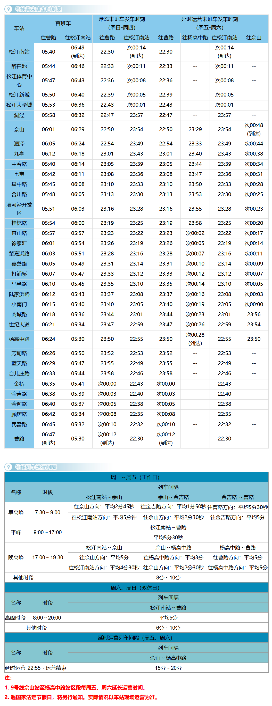

# 上海地铁9号线

上海地铁9号线，是上海第六条开通运营的轨道交通线路（与[6号线](./6.md)、[8号线](./8.md)同日开通），于2009年12月5日开通试运营。线路东起浦东新区曹路站，途径浦东新区、黄浦区、徐汇区、闵行区、松江区，西至松江区松江南站站。

线路全长65km，共35站，其中高架站4座，地下站31座。

线路标识色为#71C5E8，采用6A编组列车，最大时速80km/h，由上海地铁第一运营有限公司运营。

## 历史
* 2007年12月29日，上海地铁9号线一期工程（松江新城站至桂林路站）开通运营，由于线路脱网运营，桂林路站至宜山路站区间采用地面公交免费接驳。
* 2008年12月28日，上海地铁9号线一期遗留段（桂林路站至宜山路站）开通运营，桂林路站至宜山路站区间短驳公交同时取消，上海地铁9号线接入上海地铁网。
* 2009年12月31日，上海地铁9号线二期工程（宜山路站至世纪大道站）开通运营。
* 2014年9月26日，上海地铁9号线三期东延伸段（杨高中路站至曹路站）开工建设。
* 2017年12月30日，上海地铁9号线三期东延伸段（杨高中路站至曹路站）开通运营。

## 运营时间

## 所用车型
### 09A01
* 曾用型号：AC-04
* 制造商：庞巴迪长春客车
* 设计时速：80km/h
* 车辆编组：6A(Tc+Mp+M+M+Mp+Tc)
* 车厢：长23.54米，宽3米
* 设计寿命：30年
* 车辆总数：10列(09001-09010)
* 昵称：蚕宝宝
* 注：本车曾在1号线运营，编号0130-0139
### 09A02
* 曾用型号：AC-09
* 制造商：庞巴迪长春客车
* 设计时速：80km/h
* 车辆编组：6A(Tc+Mp+M+M+Mp+Tc)
* 车厢：长23.54米，宽3米
* 设计寿命：30年
* 车辆总数：41列(09011-09051)
* 昵称：坂田
### 09A03
* 制造商：庞巴迪长春客车
* 设计时速：80km/h
* 车辆编组：6A(Tc+Mp+M+M+Mp+Tc)
* 车厢：长23.54米，宽3米
* 设计寿命：30年
* 车辆总数：36列(09053-09088)
* 昵称：创可贴
### 09A04
* 制造商：庞巴迪长春客车
* 设计时速：80km/h
* 车辆编组：6A(Tc+Mp+M+M+Mp+Tc)
* 车厢：长23.54米，宽3米
* 设计寿命：30年
* 车辆总数：17列(09089-09105)
* 昵称：创可贴二世

## 车辆基地
* 九亭车辆段
* 金桥停车场